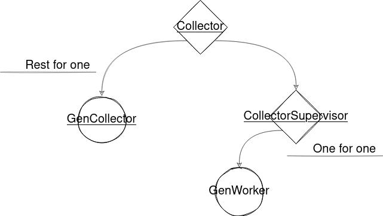

# Collector

## Function
This app fetch the data from Travian servers, process a little bit the data and stores it.
This happens once per day because the data in the servers is refreshed daily.

## Events
In order to receive events, you need to subscribe to it
```elixir
Collector.subscribe()

{:collector_event, :collection_started}
{:collector_event, :collection_finished}

# while collecting
{:collector_event, {:snapshot, server_id}}
{:collector_event, {:info, server_id}}
```


## Architecture


